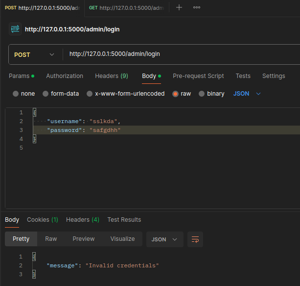
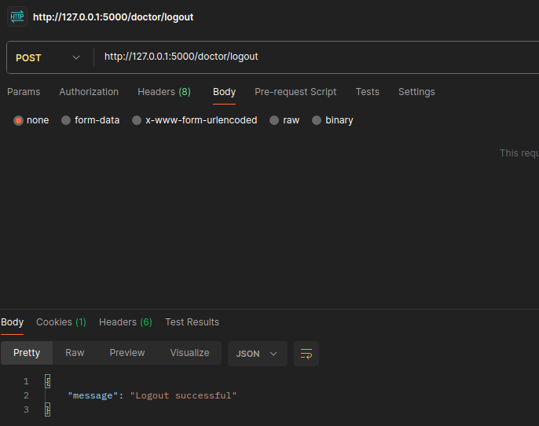
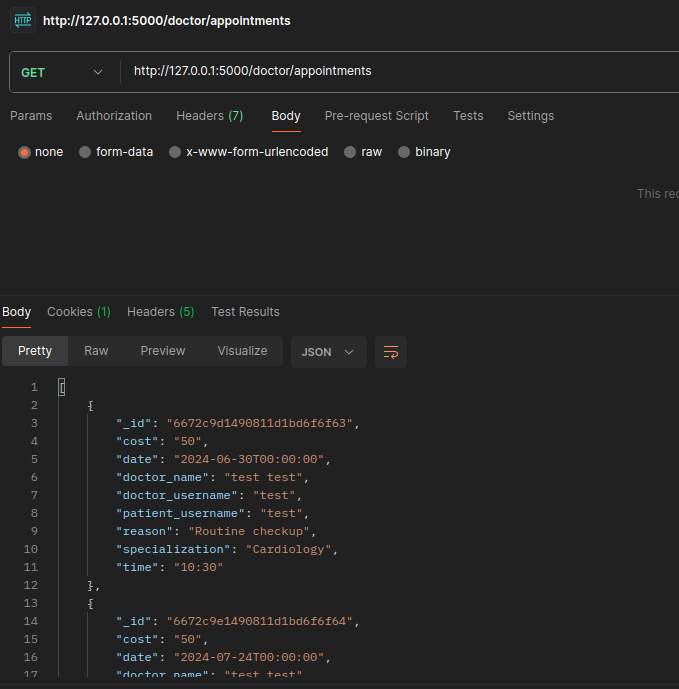
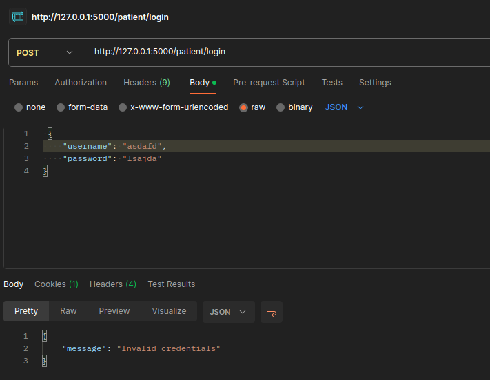

# Hospital Information System


This project is a hostpital information system that supports the following types of users: administrators, doctors and patients. The information system is build with python Flask and MongoDB.

## Assumptions

For running this application the following software is assumed that it is already installed.

- **Python**: Required for running the Flask application. 
- **Docker**: Docker is required to run the application in containers.
- **Docker Compose**: Docker Compose is needed to manage multiple Docker containers.

Also, for testing purposes **Postman** is used for sending the requests.


## Technologies Used

- **Flask**: Flask is a lightweight python framework used in thir project for developing all the endpoints that support the required functionalities.
- **PyMongo**: Pymongo includes tools for working with MongoDB in a python environmnet and in this project it is used as the database interface for the application.
- **MongoDB**: MongoDB is a NoSQL database that uses JSON-like documents with schema. In this project it is used to store all application data including user information, appointments, etc.
- **Docker**: Docker is used to containerize the application.
- **Docker Compose**: Docker-compose is used for running both the Flask application and MongoDB database containers.

## Project Files
```
hospital/
│
├── flask/
│ ├── app.py
│ ├── Dockerfile
│
├── docker-compose.yml
├── README.md
```
#### `app.py`
The `app.py` is the Flask application file and it contains all the endpoints for the admin, doctor, and patient functionalities. It handles user login, register, logout appointment management, and all the other required functionalities of the application.

#### `Dockerfile`
This is a Dockerfile that defines the Docker image for the Flask application. It includes the base image, installation of dependencies, and the setup of the application environment.

#### `docker-compose.yml`
This is a Docker Compose file to set up and manage both the Flask application and the MongoDB database.


## Setup Instructions

1. **Clone the Repository**:
    ```bash
    git clone https://github.com/jkapsalis/YpoxreotikiErgasia24_E19062_Kapsalhs_Ioannis.git
    cd YpoxreotikiErgasia24_E19062_Kapsalhs_Ioannis
    ```

2. **Build and Run Docker Containers**:
    ```bash
    sudo docker-compose up --build
    ```


## Admin Endpoints

### 1. Admin Login

**URL**: `/admin/login`  
**Method**: `POST`  

This endpoint allows the admin to log in their account by providing their correct credentials (admin username and password). If the credentials are correct, the session is started and the response is a corresponding message.

**Successful Login:**  


**Invalid Credentials:**  
If the credentials are incorrect, the response is informing appropriately. 



**Missing Fields:**  
If the request does not include all the necessary fields for the login (in this case the username and the passowrd) then the response informs appropriately. 


### 2. Admin Logout

**URL**: `/admin/logout`  
**Method**: `POST`  

This endpoint logs out the admin by ending their session.

**Successful Logout:**  


### 3. Create a Doctor

**URL**: `/admin/doctors`  
**Method**: `POST`  

This endpoint allows the admin to create a new doctor account by providing the necessary indormation in the request. If all the information are provided then the doctor is created and a corresponding message shows up in the response. 


**Successful Doctor Creation:**  


**Missing Fields:**  
If some of the necessary fiels for the doctor creation is missing, then the response includes a corresponding message. 


**Doctor Already Exists:**  
If a doctor with the same email or username already exists in the database, the creation of the doctor fails and the response includes a coresponfing message.


**Unauthorised Admin**
This endpoint is only available if the admin has already logged in.
 

### 4. Change Doctor's Password

**URL**: `/admin/doctors/<username>/password`  
**Method**: `PUT`  

This endpoint allows the admin to change the password for an existing doctor account. The new password must be provided in the request body, while the username of the doctor is part of the constructed URL. 


**Successful Password Change:**  


**Missing New Password:**  
If the new password is not provided, the response includes a corresponding message. 


**Doctor Not Found:**  
If the docotr's username is not correct, then the responce includes a message that informs about it. 


### 5. Delete a Doctor

**URL**: `/admin/doctors/<username>`  
**Method**: `DELETE`  

This endpoint allows the admin to delete a doctor account by specifying the doctor's username. All appointments of the specified doctor are also deleted.

**Successful Deletion:**  


**Doctor Not Found:**  
If the specified username does not match an existing doctor in the database then the responce informs appropriately. 


### 6. Delete a Patient

**URL**: `/admin/patients/<username>`  
**Method**: `DELETE`  

This endpoint allows the admin to delete a patient account by specifying the patient's username. All associated appointments are also deleted.

**Successful Deletion:**  


**Patient Not Found:**  


## Doctor Endpoints

### 1. Doctor Login

**URL**: `/doctor/login`  
**Method**: `POST`  
This endpoint authenticates doctors and starts their session if the provided credentials are correct.   

**Successful Login:**  


**Invalid Credentials:**  
If the provided credentials are incorrect, the response includes a corresponding message.


**Missing Fields:**  
If one of the fiels is missing the response informs about that with a message.


### 2. Doctor Logout

**URL**: `/doctor/logout`  
**Method**: `POST`  
This endpoint logs out doctors by ending their session.  

**Successful Logout:**  


### 3. Change Password 

**URL**: `/doctor/password`  
**Method**: `PUT`  
This endpoint allows doctors to change their password by providing a new password.  

**Successful Password Change:**  


**Missing New Password:**  


**Unauthorised Doctor**
This endpoint is only available in doctors that are logged in.


### 4. Change Appointment Cost

**URL**: `/doctor/appointment-cost`  
**Method**: `PUT`  
This endpoint allows doctors to update their appointment cost by including a new cost in the request.  

**Successful Cost Change:**  


**Missing New Cost:**  


### 5. View Appointments

**URL**: `/doctor/appointments`  
**Method**: `GET`  
This endpoint allows the doctor to view all their upcoming appointments.  

**Successful Retrieval:** 




## Patient Endpoints

### 1. Patient Registration

**URL**: `/patient/register`  
**Method**: `POST`  
This endpoint allows a new patient to register by providing these fields: first name, last name, email, AMKA, birthdate, username, and password.  

**Successful Registration:**  


**Missing Fields:**  
If one or more of these fiels does not exist in the request, then the response includes the following message.


**Patient Already Exists:**  
If a patient is already registered with the same email or username then a corresponding message is included in the response. 


### 2. Patient Login

**URL**: `/patient/login`  
**Method**: `POST`  
This endpoint allows patients to log in by providing their username and password.


**Successful Login:**  
If the credentials are correct, the session is started.  


**Invalid Credentials:**  
If the provided credentials are incorrect, then the response is the following.


**Missing Fields:**  
If one of the fiels is not included then the following message is included in the response.


### 3. Patient Logout

**URL**: `/patient/logout`  
**Method**: `POST`  
This endpoint logs out patients by ending their session.  

**Successful Logout:**  


### 4. Book an Appointment

**URL**: `/patient/appointments`  
**Method**: `POST`  
This endpoint, with the POST method, allows the patient to book an appointment by providing:  date, time, specialization, and reason for the appointment.  


**Successful Booking:**  


**Missing Fields:**  
If one of the fiels is missing, the response is the following.


**No Available Doctor:**  
If such a doctor does not exist, then the following message is included in the response. 


**Unauthorised Patient**
If the patient does not have a running session, the response will inform appropriately. 


### 5. View Future Appointments

**URL**: `/patient/appointments`  
**Method**: `GET`  
This endpoint, with a GET request, allows the patient to view all their upcoming appointments.  


**Successful Retrieval:**  


### 6. View Details of a Specific Future Appointment

**URL**: `/patient/appointments/<appointment_id>`  
**Method**: `GET`  
This endpoint allows patients to view the details of a specific appointment they have already made, by providing the appointment ID.  

**Successful Retrieval:**  


**Appointment Not Found:**
If the provided ID does not match an existing appointment of this patient, then the response includes the following message.  


### 7. Cancel a Future Appointment

**URL**: `/patient/appointments/<appointment_id>`  
**Method**: `DELETE`  
This endpoint, with the DELETE method, allows the patient to cancel a specific appointment by providing the appointment ID.  

**Successful Cancellation:**  


**Appointment Not Found:**  

